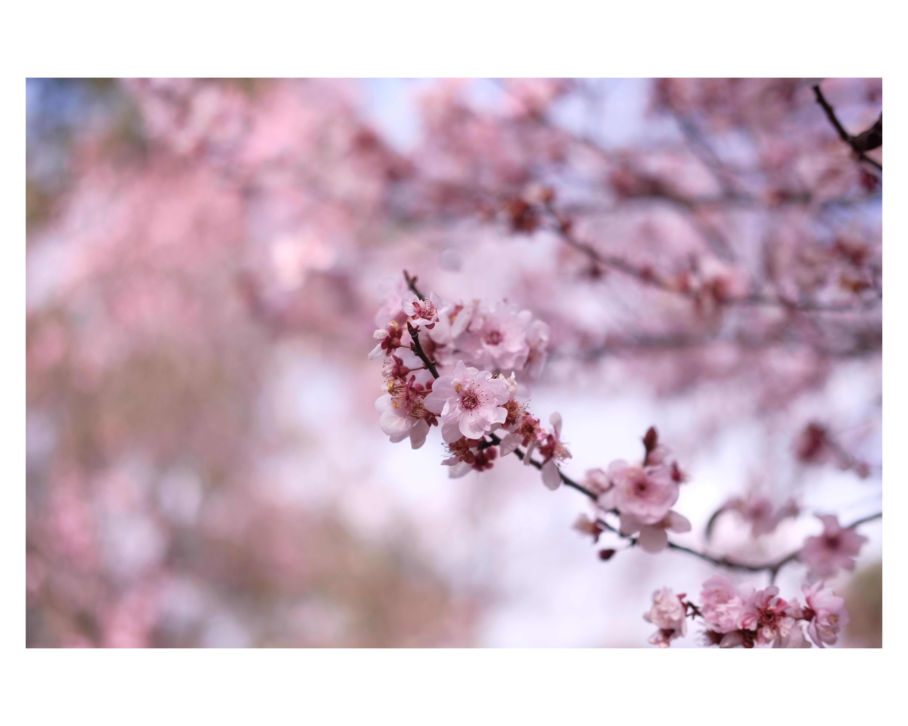

# polaroid-image-decorator-cli

A quick script to add polaroid-esque borders to images.
Don't know if it'll work outside of Unix environments.

The new images will be suffixed with `_POLAROID` and saved as `.jpg` in the same
location as the original files.

It defaults to a square aspect ratio and `md`
thickness borders (3% on each end of the longer image dimension)

```bash
python3 -m pip install --upgrade pip
pip install -r requirements.txt

python3 create_image.py [...flags] <...image_paths>
```

## Examples

Original Image


With default settings


With `--nb` flag (no border)


With `--xl` flag (xl thickness border)


with `--5-4` flag (5:4 aspect ratio)


